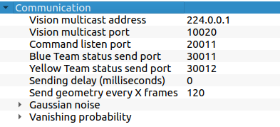

# NeonFC - Neon Futebol Clube

### Software de estrategia da Equipe Project Neon

Software desenvolvido inicialmente para LARC 2020 na sua modalidade online

### Instalação

#### Para usar o NeonFC você irá precisar ter instalado em sua maquina:

- Python >=3.7.x
- PiPy
- Google protobuf

Além de uma interface que irá fazer enviar os dados do campo atualmente [FIRASim](https://github.com/fira-simurosot/FIRASim) é suportado.

#### passo-a-passo da instalação:

1. Clonar o repositorio
```bash
git clone https://github.com/project-neon/NeonFC.git
```

2. Instalar dependencias usando pipy:

```bash
cd NeonFC
python -r requirements.txt
```

2.1. Antes de executar, é importante checar o arquivo de configuração para verificar se as portas e endereços de rede estão compativeis com o software de simulação.

No FiraSIM:



No ```config.json```:

```json
{
    "network" : {
        "multicast_ip": "224.0.0.1",
        "host_ip": "localhost",
        "blue_port": 30011,
        "yellow_port": 30012,
        "vision_port": 10020,
        "command_port": 20011
    },
    "match" : {
        "robots": 5
    }
}
```

3. Agora basta rodar ```Python main.py```

### Desenvolvimento

Esse repositorio é desenvolvido pela equipe Project Neon, mas sinta livre para Forkar!

Manual de desenvolvimento ainda esta WIP mas as documentação irá ser construida [aqui](wiki)
